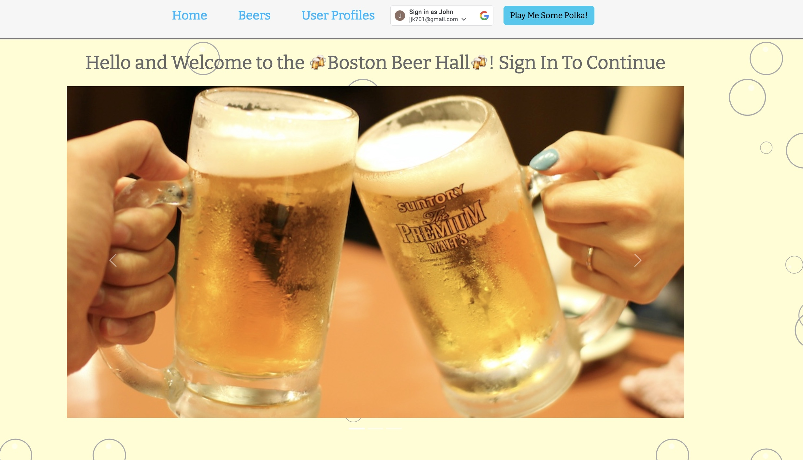

Welcome to the Boston Beer Hall!

## GO TO THE BEER HALL HERE: [Boston Beer Hall](https://boston-beer-hall.fly.dev/)

Welcome to the Boston Beer Hall(BBH)! BBH is where you can add your favorite beers and also add yourself a sweet, salty or sweet/salty snack! You need to login through Google OAuth to gain access to add, delete, edit and update beers and snacks. To add a beer, start with in the beer page. You can then see your beer. Clicking on the link in your beer list allows you to edit or delete the beer. If you go to user profiles after you create a beer, you can see your beer list and also add a snack. 

### Languages used:

 * HTML
 * CSS
 * JavaScript
 * git
 * Bootstrap
 * Google OAuth
 * Mongoose

Planning materials can be found here: [link](https://trello.com/b/etY7i4rU/boston-beer-hall)

The favicon came from Favion.Io: [link](https://favicon.io/favicon-generator/)

The favicon came from Codepen by Diyorbek Olimov: [link](https://codepen.io/diyorbek0309/pen/mdwbEve)

The beer descriptions came from drinkwel.com: [link](https://www.drinkwel.com/blogs/drinkwel-blog/24634561-top-10-types-of-beer)

Emojis came from Emojipedia: [link](https://emojipedia.org/)

The fonts used are from Google Fonts :[link](https://fonts.google.com/)

Flexbox, billboards, buttons and form styling and functionality was used by implementing the Boostrrap CDN: [link](https://getbootstrap.com/")

User authorization was implemented using Google OAuth: [link](https://console.cloud.google.com/apis/)

The images for the rotating billboard on the homepage are from Unsplash: [link](https://unsplash.com)
- Image one is from: Kazeund
- Image two is from: George Bakos
- Image three is from: Meritt Thomas

## Ice Box ❆
- Add polka music button
- Ability to favorite another persons beer
